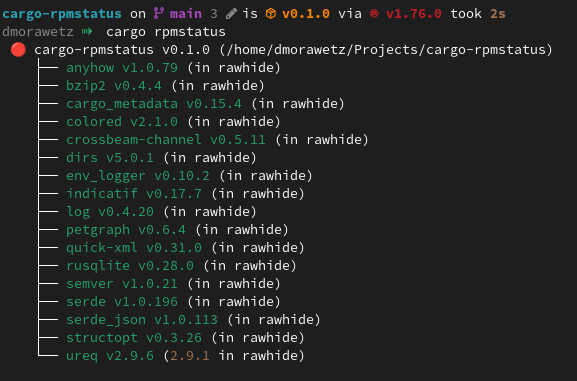

# cargo-rpmstatus

cargo-tree for rpm packaging. Traverse all dependencies of a project, checks
if the dependency is already in fedora rawhide, or if it needs
to be updated.

The codebase is a modified version of [kpcyrd/cargo-debstatus](https://github.com/kpcyrd/cargo-debstatus).

## How to run

```shell
$ cargo install cargo-rpmstatus
$ cargo rpmstatus
```



## Known Bugs

- Some indirect optional dependencies are ignored

## License

This codebase is licensed:

```
(MIT OR Apache-2.0) AND GPL-3.0-or-later
```

due to it's use of cargo-tree code. The cargo-debstatus code is licensed
`GPL-3.0-or-later`. The cargo-rpmstatus code, therefore, is also licensed `GPL-3.0-or-later`. Terms of the GPL apply.
